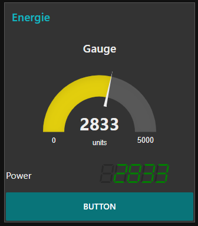

# SegmentDisplay
This 7/14/16 SegmentDisplay is a Enhancements for [NodeRed-Dashboard](https://github.com/node-red/node-red-dashboard).  
The library was developed by [3Quarks](http://www.3quarks.com/en/SegmentDisplay).  
Tested in Node-Red-Dashboard V 2.8.3 in V 2.9.4 is not running.  
Thanks for the great work.

## Change File : package.json
<pre>
"node-red": {
        "nodes": {
            ...
	"ui_segmentdisplay":"nodes/ui_segmentdisplay.js"
}
</pre>

## Change File : src/index.html
<pre>
&lt;!--Segment Display --&gt;

</pre>

## New Files
|File|Info
|---|---
|node_module/segmentdisplay/segment-display.js|SegmentDisplay Object from 3Quarks
|nodes/ui_segmentdisplay.html|Node-Red-Dashboard Node
|nodes/ui_segmentdisplay.js
|nodes/icons/ui_segmentdisplay.png
|src/components/ui-segmentdisplay/ui-segmentdisplay.html|Template Canvas
|src/components/ui-segmentdisplay/ui-segmentdisplay.js|Directive uiSegmentdisplay
|src/components/ui-component/templates/segmentdisplay.html|md-card Template with Directive
|src/components/ui-component/templates/segmentdisplay.css

## Sample Create Object
<pre>
var disp = new SegmentDisplay("canvas id");
disp.pattern = "#####";
disp.digitHeight = 11;
disp.digitWidth = 7;
disp.cornerType = 3;
disp.segmentType = 7;
disp.displayAngle = 9;
disp.digitDistance = 1;
disp.segmentWidth = 1;
disp.segmentDistance = 0.5;
disp.colorOn = "red";
disp.colorOff = "#111111";
disp.draw();
disp.setValue("12345");
</pre>

